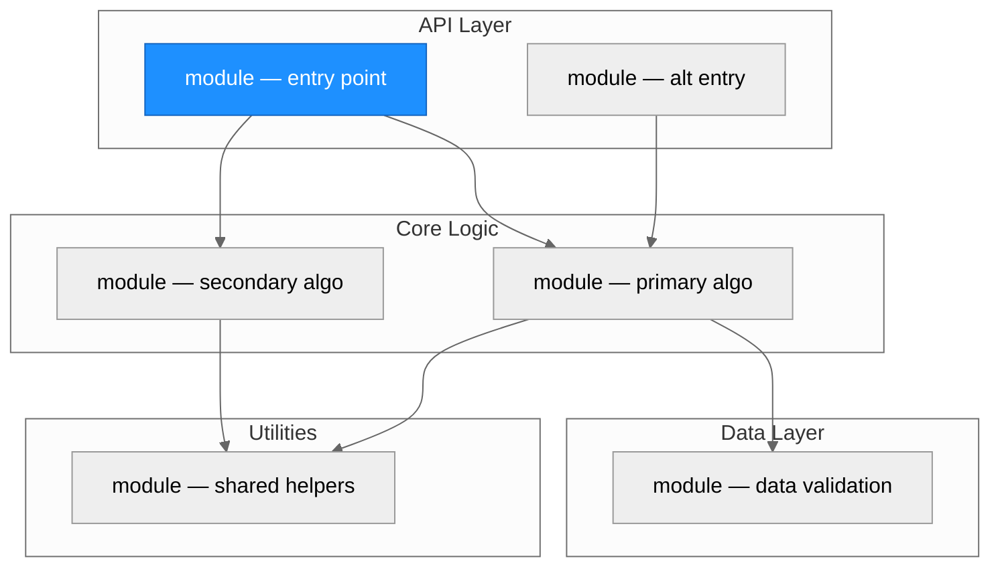
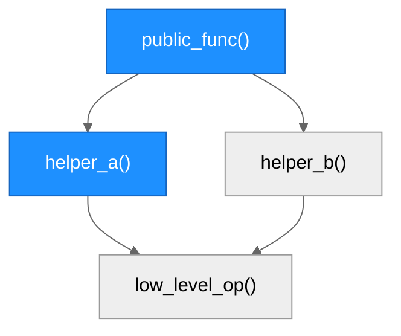
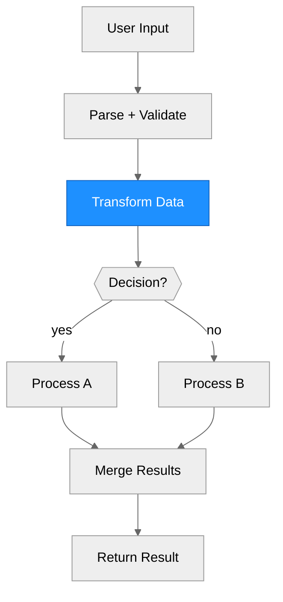

# Architecture — [Package Name]

> Generated by scriber for run `[request-id]` on [YYYY-MM-DD].

## Overview

[One paragraph summarizing the repository's purpose, primary abstraction, and overall design approach. State the language, framework, and key external dependencies.]

---

## Module Structure

> One unified diagram. Subgraph layers group related modules. Blue fill = modified in this run. If a layer has >5 modules, show key ones here and list the rest in the table below.

### Module Reference

| Module / File | Layer | Purpose | Key Exports | Changed |
| --- | --- | --- | --- | --- |
| `[path]` | API | [purpose] | `[functions]` | yes / no |
| `[path]` | Core | [purpose] | `[functions]` | yes / no |
| `[path]` | Data | [purpose] | `[functions]` | yes / no |
| `[path]` | Utils | [purpose] | `[functions]` | yes / no |

---

## Function Call Graph

> Blue nodes = changed. Trace from public entry points down to leaf operations. Split into sub-diagrams only when the full graph exceeds ~25 nodes.

### Function Reference

| Function | Defined In | Called By | Calls | Changed | Purpose |
| --- | --- | --- | --- | --- | --- |
| `public_func()` | `[file]` | user / exported | `helper_a`, `helper_b` | yes / no | [one-line] |
| `helper_a()` | `[file]` | `public_func` | `low_level_op` | yes / no | [one-line] |

---

## Data Flow

> Vertical flowchart. Diamond nodes for decision points. Branches rejoin quickly. Blue = changed in this run.

---

## Architectural Patterns

[Bullet list of patterns observed in the codebase. Examples:]

- **[Pattern name]**: [where it appears and why it matters]

---

## Notes

- [Any observations about code organization, technical debt, or design decisions relevant to the current run.]
